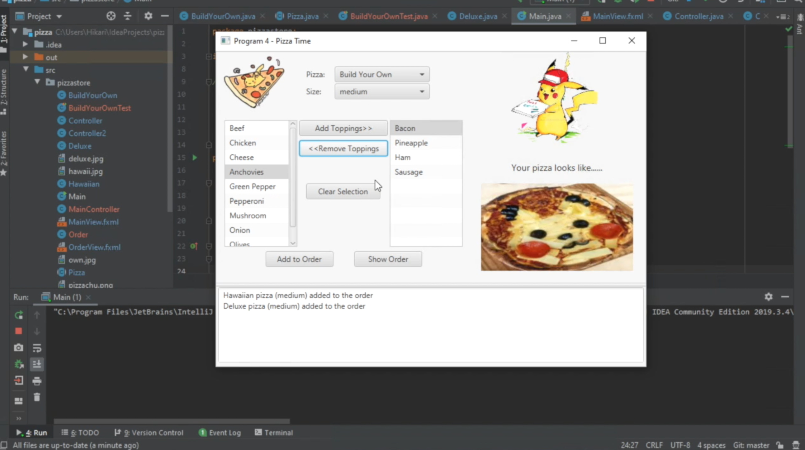
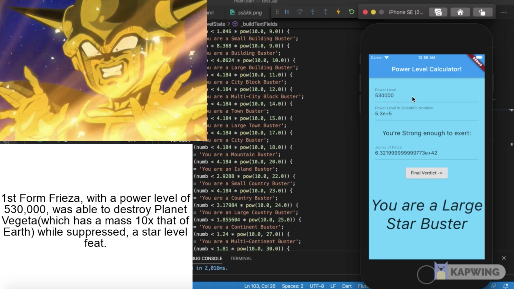
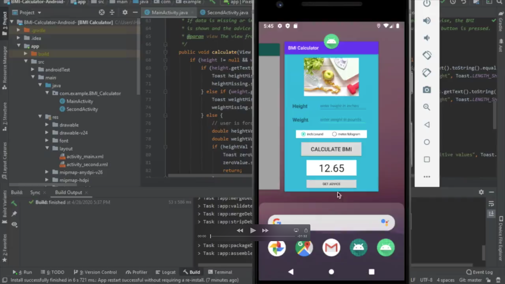
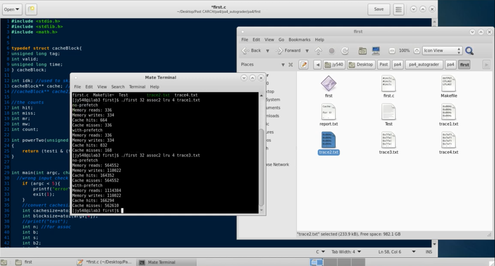

# Welcome!
Hello! I am Jerry Yang, currently majoring in Computer Science and Finance!
See more information below!
## Resume
Click [here!](resume.pdf) for my resume!
## Project Demos

###Artificial Intelligence

**The Maze is On Fire!**
In this project, I worked with a partner and created an AI that attempts to reach the goal in a maze. The maze is a square and the AI will be unable to travel through walls or ”occupied cells”. In addition, the maze may be set on fire. In this case, the fire will spread with each move of the AI.This project is done in Python and Pygames is used for the GUI. Numpy and matplotlib were used for the graphs. In the report below. Below are some sample images. In the first is an Agent performing DFS search in a 200x200 maze without any fire in it's way. The latter recomputes the shortest path using the A* algorithm, while exercising "caution" to account for future states.

### Software

**Pizza Ordering System:**

Click below to watch!

Using Java's abstract classes as well as Polymorphism, I developed a GUI using JavaFX which enabled the
users to order Pizza from a Pizza Store. The user is able to choose from the menu as well as build their own
from the various topping choices given to the user. When finished, the user is able to open their order on a
separate window and proceed to conrm their order, go back to the menu, or clear the order entirely.

**Online Railway Booking System:**

Click below to watch!

This is a group project where we made a relational database system designed to support the operations of an online railway booking system. HTML was used for the user interface, MYSQL for the database server, and Java, Javascript, and JDBC was used for the connectivity between the user interface and database server. It was hosted under AWS for a period of time but the instance has been taken down as the free tier is no longer available. The video is a demo of the functions including reservations, questions and answers between customer reps and customers, and other admin functions.

### Mobile Development

**Power Level to Joules Calculator:**

Click below to watch!

A quick and simple app developed using Dart and Flutter. Calculation credits to SeththeProgrammer. The App takes an input of a powerlevel, and then converts it into the amount of joules of force one is able to output using the Dragon Ball Anime feats as guidelines. When no feats are present, the joules output takes on a linear scale as that's how techniques like the kaioken work. Some quick feats it follows:

Master Roshi with a power level of 180 could blow up the moon, so the joules output would be greater or equal to the force needed to do that.

King Vegeta with a power level of 10000 could destroy 3 small planets with ease, so the joules output would be greater or equal to the force needed for that.

Cell is stated to be a solar system buster, so his power level, while not stated in the series, would be where the joules output would be big enough to wipe one out.

**BMI Calculator:**

Click below to watch!

I Developed an Android App through the use of Android Studio. It calculates the BMI and gives proper advice
based on on the Department of Health and Human Services. The app allows users to enter their weight and
height in either customary or metric units. The activity will then shift depending on whether or not the user
wants advice from the app.

### Simulation

**Cache Simulator:**

Click below to watch!

I created a Cache simulator using C, simulated an L1 cache using the Least Recently Used(LRU) replacement
algorithm, and included an option to incorporate prefetching

### Programming Projects

I toyed around with various different programming languages in a series of programs in order to get a feel for the different kinds of programming including but not limited to functional, logical, and dynamic programming. I covered a large number of topics from BSTs and Huffman Trees to regex and automatas. 

Here are just some of the samples!

**Huffmantrees and DFAs:**

Using Haskell to work with functional programing, I worked with huffman trees. "codes" returns a list of every element in the tree along with its encoding as a sequence of bits, while decode takes in a huffman tree and a stream of bits and "decodes" it, giving the string of symbols encoded, as well as a boolean indicating whether or not any bits were left over.

Utilizing Haskell, I built a series of Deterministic finite automatons. As shown in the sample, the first DFA accepts any language over {A,B,C} where every non-final A is followed by a B, every non-final B is followed by a C, and so forth. The second accepts the string as long as it contains the sequence "AB" or "BA" somewhere in the string.

**BSTs and Lists:**

Using Prolog to work with logical programing, I worked with BSTs and lists. "bst" checks whether or not the input binary search tree is semi-deterministic. "zip" zips the elements of the first input with the second input and places it in the third as a list. The third list is always shorter or as long as the first two lists as extra elements are discarded. "insert" inserts an element into a list and stores it in the third list. 

**Bit Manipulation:**

Click below to watch!

Using C and restricted to using only the 6 Bit Operators included with C, I created a series of Bit
functions from guring out a bit's parity to palindrome checking.

