<nav>
  <a href="/" class="active">About</a>
  <a href="/ai">Artificial Intelligence</a>
  <a href="/software">Softare Development</a>
  <a href="/network">Networking and Architecture</a>
  <a href="/mobile">Mobile Programming</a>
  <a href="/game">Gaming and Game AI</a>
</nav>

# Welcome!
Hello! I am Jerry Yang, currently majoring in Computer Science and Finance, graduating May 2021!
See more information below!

## Resume
Click [here!](resume.pdf) for my resume!
## Project Demos

### Artificial Intelligence

**Hidden Markov Models! Sign Language**

This project involves using the coordinates of the hand and thumbs to analyze sign language. After building an HMM, I built a Viterbi Trellis and return the sequence of states along with the confidence probability based on the evidence input. As of right now, the project involves deciphering only the following three words.

Alligator, Nuts, and Sleep

 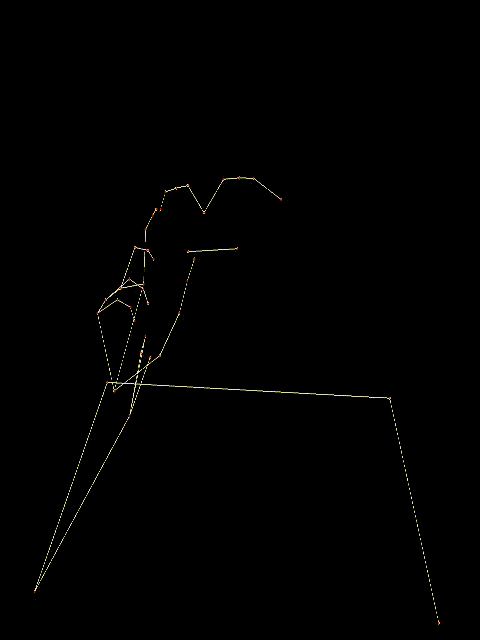 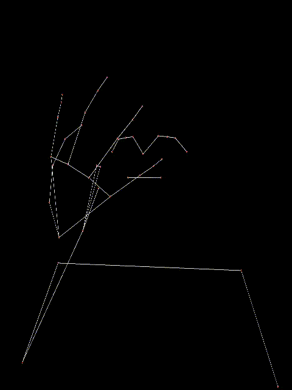

Below is some example test runs:

**Machine Learning for Trading**

This project involes using machine learning techiques to help trade stocks The entire paper on the project can be found here.

As a brief overview, one of the techniques used was random forests and it was able to beat out our manual technique by quite a bit. The manual technique is a using basic logic of Bollinger Bands and SMA (and other financial techniques) to act upon the stocks. A snippet of the results can be seen below.

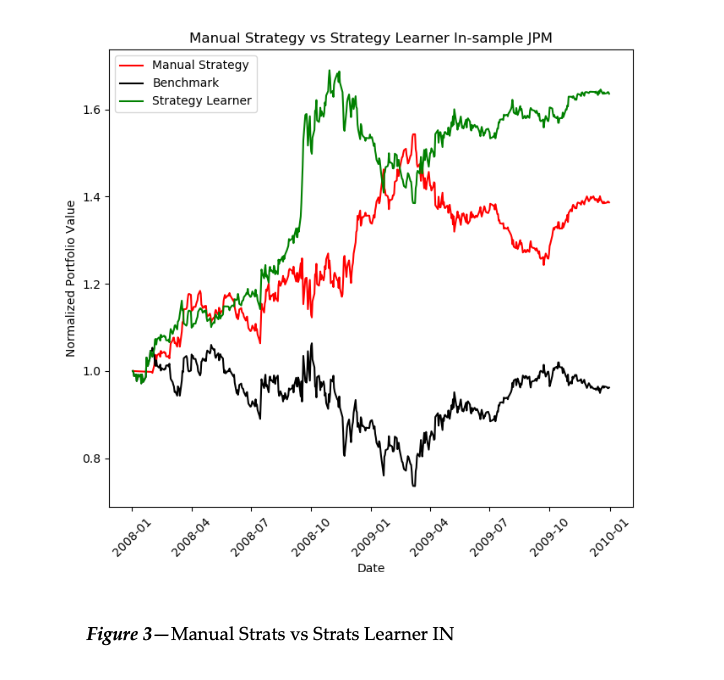

**Q Learning Robot**

This projects involves implementing Q-Learning and Dyna-Q algorithms in a game setting to practice reinforcement learning. The game world is a simple field with each field containing one of the following.
0: blank space. 
1: an obstacle. 
2: the starting location for the robot. 
3: the goal location. 
5: quicksand. 
The rules for the rewards are as follows.
-1: if the robot moves to an empty or blank space, or attempts to move into a wall 
-100: if the robot moves to a quicksand space 
1: if the robot moves to the goal space 

After impleneting the Q-Learning algorithm, Dyna-Q was also implemented so that our AI agent could "hallucinate" extra experiences. Below is a sample run of a difficult course where we can see the dyna score helped improve the non-dyna score quite a bit.

**Colorization!**

This project involves practicing computer vision along with supervised and unsupervised colors without any ML frameworks. The Agent takes in an image, greyscales it, and then divides it into two portions. It then uses the left half as training data in order to recolor the right half of the image. Here the Basic image uses K-means clustering as a way to simplify the process to recolor the image. The Improved Agent, is a mini neural network that uses gradient descent as its main means of minimizing the loss function.

Below is the original image, followed by the results of the of the basic and improved agents respectively.

    

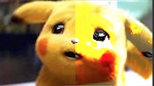

**Search and Destroy!**

This project involves an agent searching for a target through flat areas, hills, forests, and caves. Each terrain introduces a different difficulty in terms of actually being able to find the target as the target is good at hiding! The objective is for the agent to find the target in as few searches as possible as well as minimize the distance travelled. The project was made in pygames and was done to help supplement understanding of modeling knowledge and beliefs and practice the use of bayesian theory.

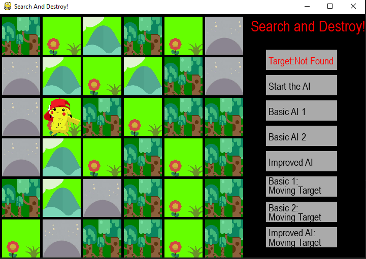

Below is a more detailed report on the project.
[Search and Destroy Report](searchdestroy.pdf)

**MineSweeper!**

In this project, I first created a game of Minesweeper in pygames. The game assets are thanks to GooseNinja from itch.io. I then made four different agents to play the game. The Basic Agent just plays with basic logic in a single case. The Improved Agent plays the game as a constraint satisfaction problem and projects it's own possible solutions. The Global Improved Agent gets additional information of the total number of cells in its knowledge base, and the second improved Agent takes a simulated annealing approach to cells it deems risky in its projected solutions.

<video controls="controls" src="mimp.mp4">
    Your browser does not support the HTML5 Video element
</video>

Below is a more detailed report on the project.
[MineSweeper Report](minesweep.pdf)

**The Maze is On Fire!**

In this project, I worked with a partner and created an AI that attempts to reach the goal in a maze. The maze is a square and the AI will be unable to travel through walls or ”occupied cells”. In addition, the maze may be set on fire. In this case, the fire will spread with each move of the AI.This project is done in Python and Pygames is used for the GUI. Numpy and matplotlib were used for the graphs in the report. In the report below. Below are some sample images. In the first is an Agent performing DFS search in a 200x200 maze without any fire in it's way. The latter recomputes the shortest path using the A* algorithm, while exercising "caution" to account for future states.

  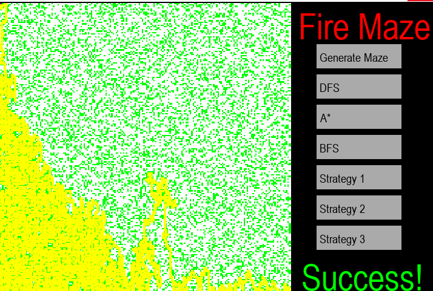

  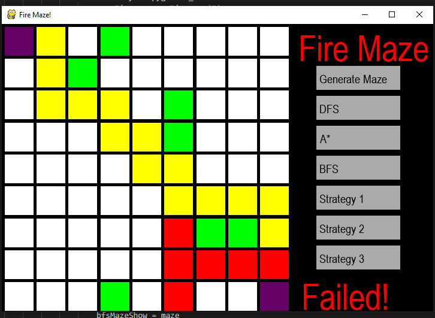

Below is a more detailed report on the project.
[FireMaze Report](fmazereport.pdf)

### Software

**Pizza Ordering System:**

<video controls="controls" src="pizza.mp4">
    Your browser does not support the HTML5 Video element.
</video>
 

Using Java's abstract classes as well as Polymorphism, I developed a GUI using JavaFX which enabled the
users to order Pizza from a Pizza Store. The user is able to choose from the menu as well as build their own
from the various topping choices given to the user. When finished, the user is able to open their order on a
separate window and proceed to conrm their order, go back to the menu, or clear the order entirely.

**Online Railway Booking System:**

Click below to watch!

[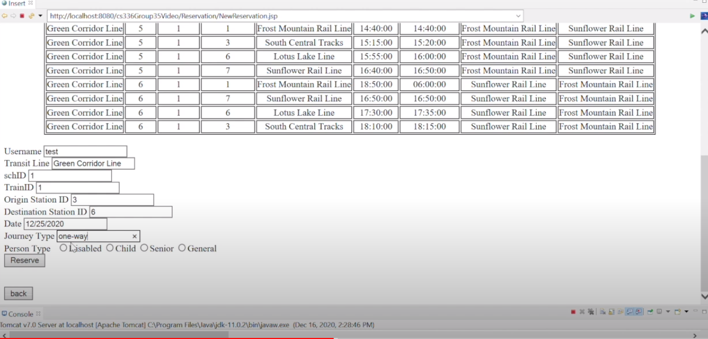](https://drive.google.com/file/d/1SY3i_AaE3vtkf3Sdvkz9j_A1vZGBTLGQ/view?usp=sharing)

This is a group project where we made a relational database system designed to support the operations of an online railway booking system. HTML was used for the user interface, MYSQL for the database server, and Java, Javascript, and JDBC was used for the connectivity between the user interface and database server. It was hosted under AWS for a period of time but the instance has been taken down as the free tier is no longer available. The video is a demo of the functions including reservations, questions and answers between customer reps and customers, and other admin functions.

### Mobile Development

**(IOS)Power Level to Joules Calculator:**

<video controls="controls" src="PowerLevelCalc.mp4">
    Your browser does not support the HTML5 Video element.
</video>

A quick and simple app developed using Dart and Flutter. Calculation credits to SeththeProgrammer. The App takes an input of a powerlevel, and then converts it into the amount of joules of force one is able to output using the Dragon Ball Anime feats as guidelines. When no feats are present, the joules output takes on a linear scale as that's how techniques like the kaioken work. Some quick feats it follows:

Master Roshi with a power level of 180 could blow up the moon, so the joules output would be greater or equal to the force needed to do that.

King Vegeta with a power level of 10000 could destroy 3 small planets with ease, so the joules output would be greater or equal to the force needed for that.

Cell is stated to be a solar system buster, so his power level, while not stated in the series, would be where the joules output would be big enough to wipe one out.

**(Android)BMI Calculator:**

<video controls="controls" src="bmi.mp4">
    Your browser does not support the HTML5 Video element.
</video>

I Developed an Android App through the use of Android Studio. It calculates the BMI and gives proper advice
based on on the Department of Health and Human Services. The app allows users to enter their weight and
height in either customary or metric units. The activity will then shift depending on whether or not the user
wants advice from the app.

### Simulation

**Cache Simulator:**

Click below to watch!
<video controls="controls" src="cache.mp4">
    Your browser does not support the HTML5 Video element.
</video>

I created a Cache simulator using C, simulated an L1 cache using the Least Recently Used(LRU) replacement
algorithm, and included an option to incorporate prefetching

### Programming Projects

I toyed around with various different programming languages in a series of programs in order to get a feel for the different kinds of programming including but not limited to functional, logical, and dynamic programming. I covered a large number of topics from BSTs and Huffman Trees to regex and automatas. 

Here are just some of the samples!

**Huffmantrees and DFAs:**

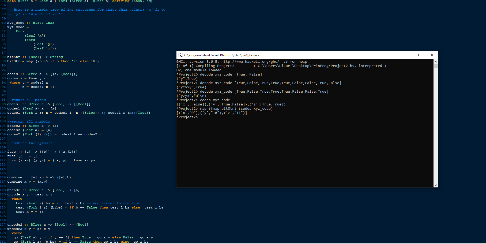

Using Haskell to work with functional programing, I worked with huffman trees. "codes" returns a list of every element in the tree along with its encoding as a sequence of bits, while decode takes in a huffman tree and a stream of bits and "decodes" it, giving the string of symbols encoded, as well as a boolean indicating whether or not any bits were left over.

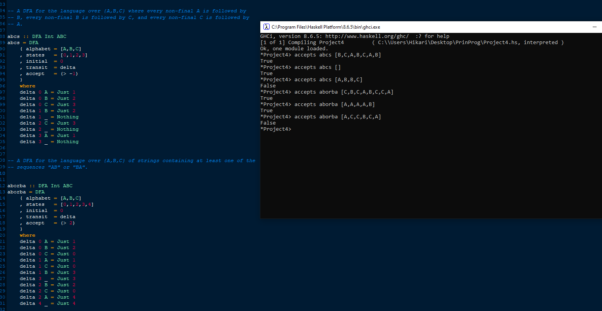

Utilizing Haskell, I built a series of Deterministic finite automatons. As shown in the sample, the first DFA accepts any language over {A,B,C} where every non-final A is followed by a B, every non-final B is followed by a C, and so forth. The second accepts the string as long as it contains the sequence "AB" or "BA" somewhere in the string.

**BSTs and Lists:**

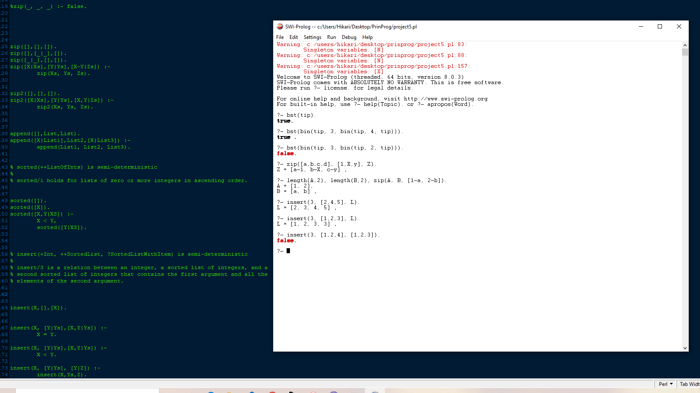

Using Prolog to work with logical programing, I worked with BSTs and lists. "bst" checks whether or not the input binary search tree is semi-deterministic. "zip" zips the elements of the first input with the second input and places it in the third as a list. The third list is always shorter or as long as the first two lists as extra elements are discarded. "insert" inserts an element into a list and stores it in the third list. 

**Bit Manipulation:**

Click below to watch!

[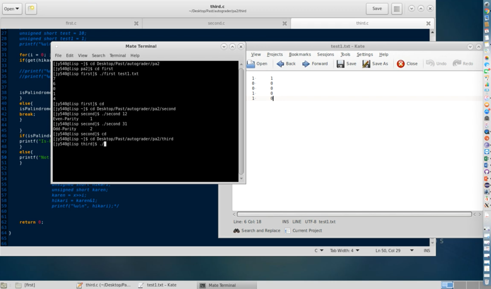](bit.mp4)

Using C and restricted to using only the 6 Bit Operators included with C, I created a series of Bit
functions from guring out a bit's parity to palindrome checking.

