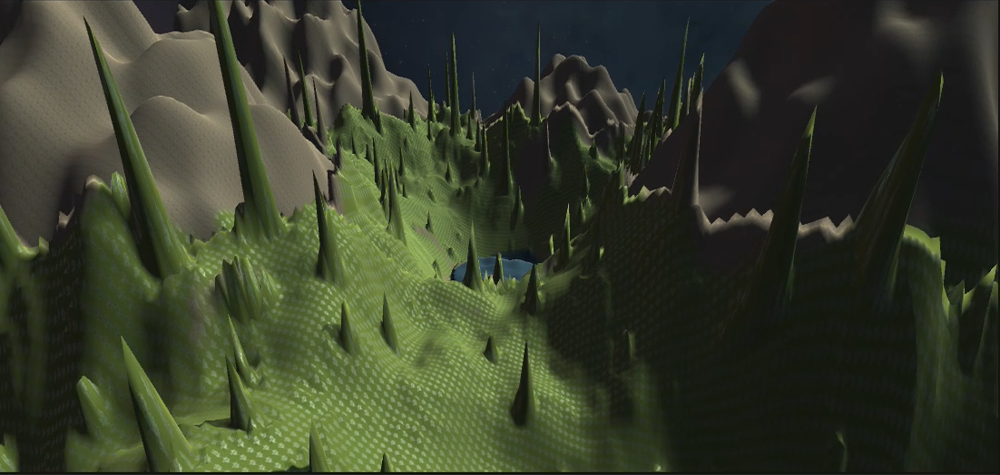
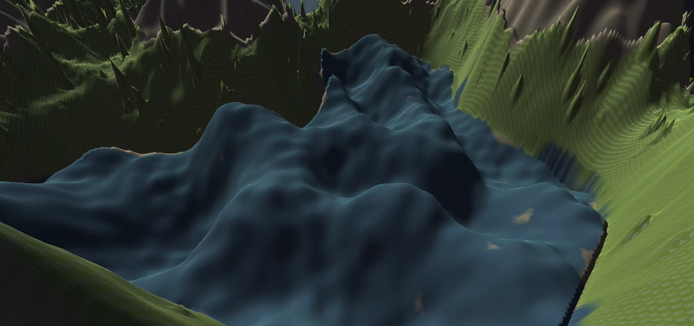
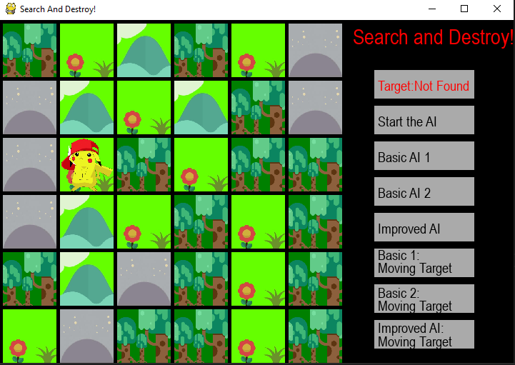
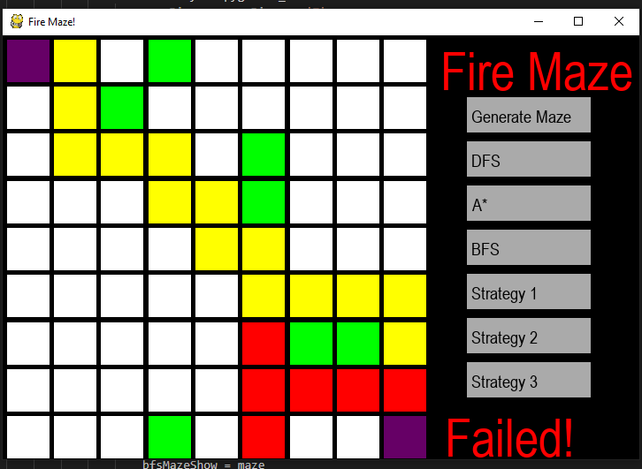

<nav>
  <a href="/">About</a>
  <a href="/ai">Artificial Intelligence</a>
  <a href="/software">Software Development</a>
  <a href="/network">Networking and Architecture</a>
  <a href="/mobile">Mobile Programming</a>
  <a href="/game" class="active">Gaming and Game AI</a>
  <a href="/other">Logical and Functional Programming</a>
</nav>

### Artificial Intelligence
**Prison Dodgeball! Ballistic Trajectory Prediction and Finite State Machines**
This project involves two parts. The first involves implrmenting the ballistic trajectory prediction for projectiles as well as shot selection logic (deciding when to throw dodgeballs). For implementation, I use Millington's static target method with iterative refinement.
The second part involves using Finite State Machines to have AIs that can defeat the other AIs in a game of prison ball. Naturally, it uses the algorithms from part 1. The results are shown below. The numbers on the sides are the current number of games won.
<video controls="controls" src="vids/gameai.mov">
    Your browser does not support the HTML5 Video element.
</video>

**Race Track: Fuzzy Logic**
Using the FuzzyLogic library by t0chas, I created a fuzzy logic control for my vehicle to drive along the road and not fall off. It does its best not to lose any speed. Results can be seen below.
<video controls="controls" src="vids/gameai7.mov">
    Your browser does not support the HTML5 Video element.
</video>

**Procedural Content Generation With Perlin Noice**
Using Perlin Noice generation with a hierarchical set of generation rules, I made a complex heightmap terrain.

My pcg terrain consists of three biomes. I named them mountains, foresty plains, and wavy river. Each of these terrains use the trapezoid function to transition
from one to the other. The mountain has a mountain base(name) which is responsible for making the mountain base, along with detail(name) , which is used to create details, 
just like in the demo video. The foresty plain is similar in that it uses a plain base, and then adds details using the plain detail(name) . Trees were also
added by zeroing out of the parrent and using a customized mapping curve with perlin noise. In the wavy river biome, we can see that the waves are quite big. I have 
a child called river level (name)  to control the level of the river, as well once again a child called river detail to alter the waves of the river.

**Search and Destroy!**

This project involves an agent searching for a target through flat areas, hills, forests, and caves. Each terrain introduces a different difficulty in terms of actually being able to find the target as the target is good at hiding! The objective is for the agent to find the target in as few searches as possible as well as minimize the distance travelled. The project was made in pygames and was done to help supplement understanding of modeling knowledge and beliefs and practice the use of bayesian theory.

Below is a more detailed report on the project.
[Search and Destroy Report](reports/searchdestroy.pdf)

**MineSweeper!**

In this project, I first created a game of Minesweeper in pygames. The game assets are thanks to GooseNinja from itch.io. I then made four different agents to play the game. The Basic Agent just plays with basic logic in a single case. The Improved Agent plays the game as a constraint satisfaction problem and projects it's own possible solutions. The Global Improved Agent gets additional information of the total number of cells in its knowledge base, and the second improved Agent takes a simulated annealing approach to cells it deems risky in its projected solutions.

<video controls="controls" src="vids/mimp.mp4">
    Your browser does not support the HTML5 Video element
</video>

Below is a more detailed report on the project.
[MineSweeper Report](reports/minesweep.pdf)

**The Maze is On Fire!**

In this project, I worked with a partner and created an AI that attempts to reach the goal in a maze. The maze is a square and the AI will be unable to travel through walls or ”occupied cells”. In addition, the maze may be set on fire. In this case, the fire will spread with each move of the AI.This project is done in Python and Pygames is used for the GUI. Numpy and matplotlib were used for the graphs in the report. In the report below. Below are some sample images. In the first is an Agent performing DFS search in a 200x200 maze without any fire in it's way. The latter recomputes the shortest path using the A* algorithm, while exercising "caution" to account for future states.

  

  

Below is a more detailed report on the project.
[FireMaze Report](reports/fmazereport.pdf)