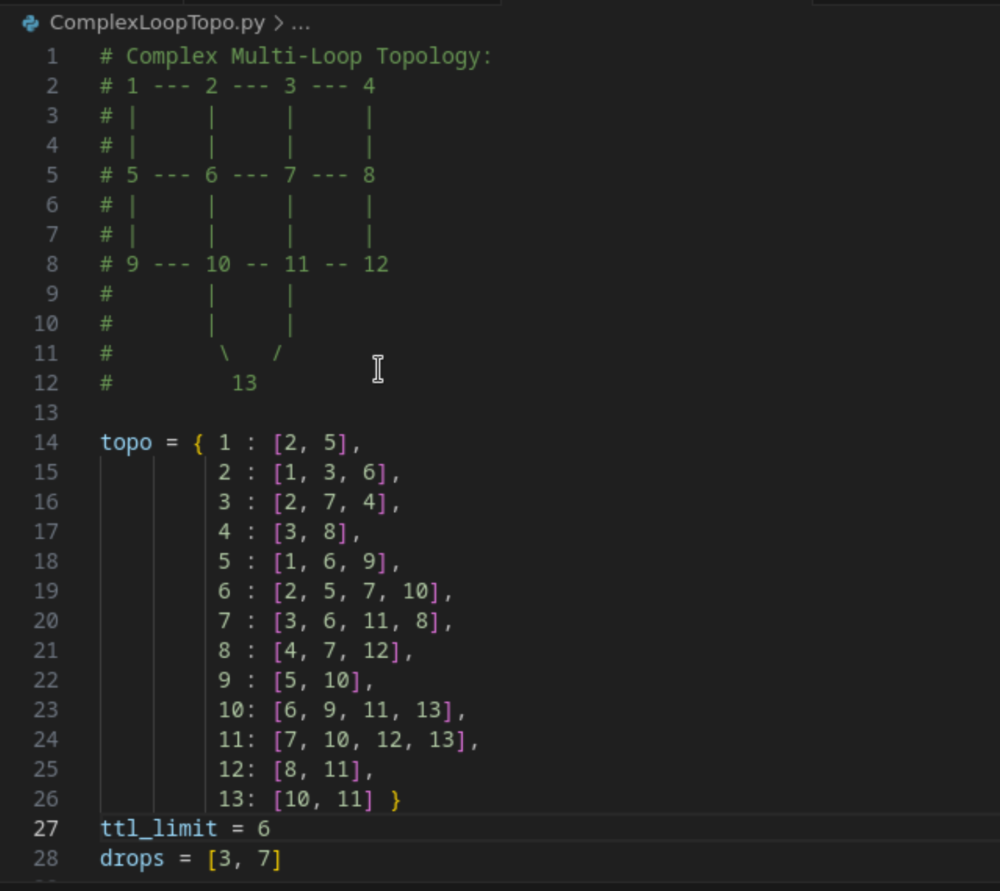
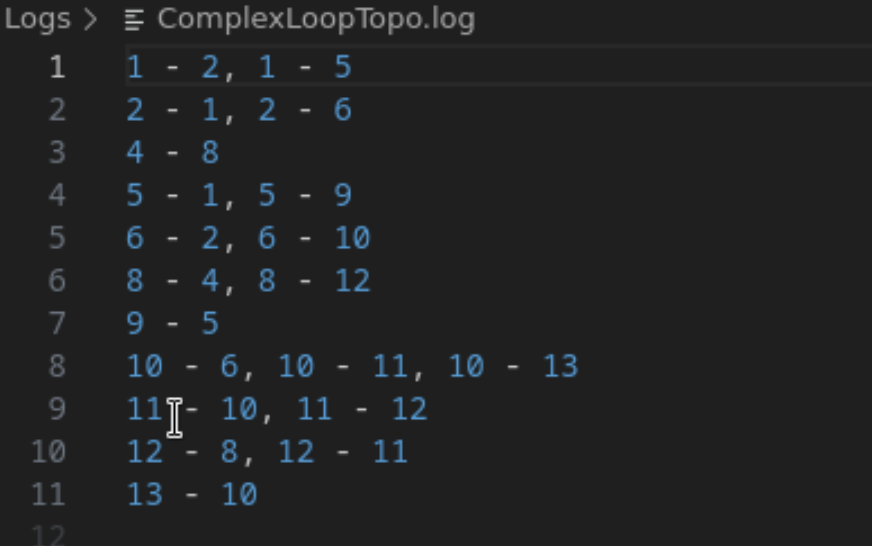
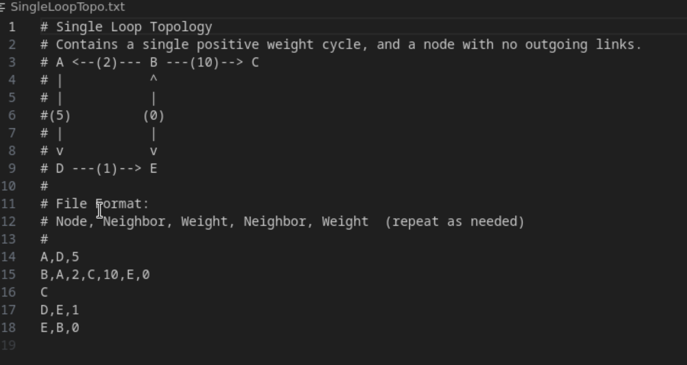
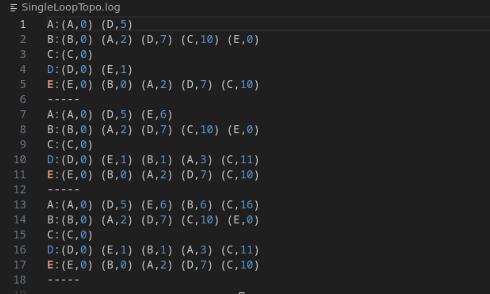
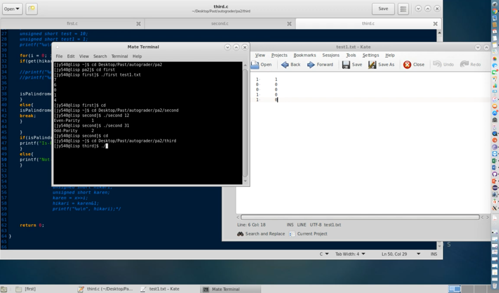

<nav>
  <a href="/">About</a>
  <a href="/ai">Artificial Intelligence</a>
  <a href="/software">Software Development</a>
  <a href="/network"  class="active">Networking and Architecture</a>
  <a href="/mobile">Mobile Development</a>
  <a href="/other">Logical and Functional Programming</a>
</nav>

# Simulation

## Cache Simulator:

Click below to watch!
<video controls="controls" src="vids/cache.mp4">
    Your browser does not support the HTML5 Video element.
</video>

I created a Cache simulator using C, simulated an L1 cache using the Least Recently Used(LRU) replacement
algorithm, and included an option to incorporate prefetching

## Spanning Tree Protocol and Distance Vector Routing

Two networking programming assignments that focus on a topology of switches.
The Spanning Tree Protocol solves the switching problem while the Distance Vector Routing project solves routing.
For the Spanning tree, I coded up a distributed algorithm and simulated communication between switches using messages. The end result returns the active links.
The output is displayed as the {sourceSwitchID} - {DestinationSwitchID}, seperating links with a comma. Pictures below are a sample topology input along with the output.
 
  
 

The Distance Vector focuses on using the Bellman-Ford algorithm and use it to calculate routing paths in a network. 
The output displays the node doing the logging followed by the neighbors along with the vector weights. Below is an example input and the final cycle of an output.
 

  
 

## SDN Firewall and BGM Measurements

The following projects were done on a VM that I no longer have access to.
The SDN Firewall project familarizes me with defining rules code, writing efficient firewall rules to describe what network is not allowed based on communication protocols and on parameters of the network topology.
For BGP Measurements, I used the BGPStream tool to understand the BGP Protocol and interacted with BGP data. 

# Other

## Bit Manipulation:

Click below to watch!

Using C and restricted to using only the 6 Bit Operators included with C, I created a series of Bit
functions from guring out a bit's parity to palindrome checking.