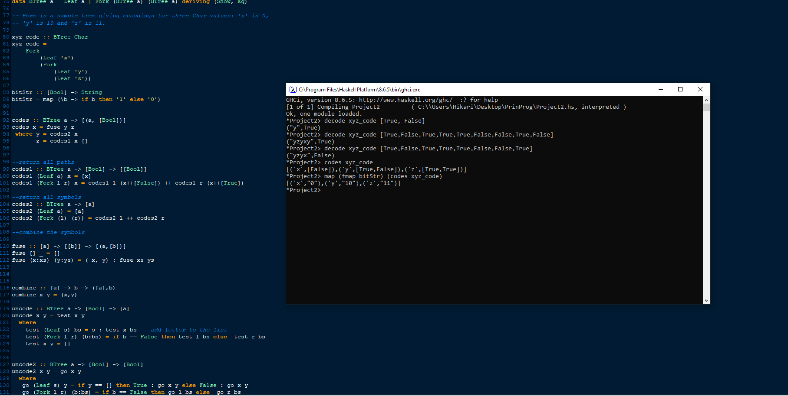
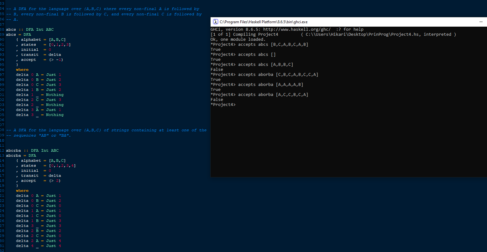
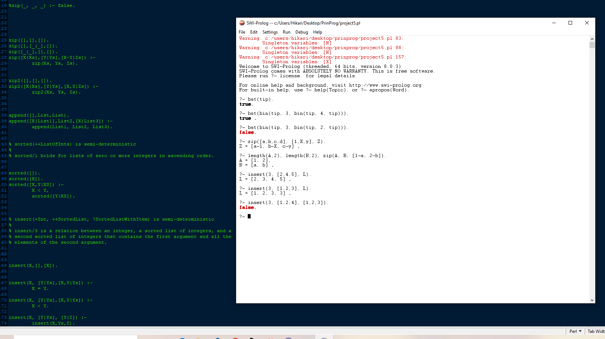

<nav>
  <a href="/">About</a>
  <a href="/ai">Artificial Intelligence</a>
  <a href="/software">Software Development</a>
  <a href="/network">Networking and Architecture</a>
  <a href="/mobile">Mobile Programming</a>
  <a href="/game">Gaming and Game AI</a>
  <a href="/other" class="active">Logical and Functional Programming</a>
</nav>

### Programming Projects

I toyed around with various different programming languages in a series of programs in order to get a feel for the different kinds of programming including but not limited to functional, logical, and dynamic programming. I covered a large number of topics from BSTs and Huffman Trees to regex and automatas. 

Here are just some of the samples!

**Huffmantrees and DFAs:**

Using Haskell to work with functional programing, I worked with huffman trees. "codes" returns a list of every element in the tree along with its encoding as a sequence of bits, while decode takes in a huffman tree and a stream of bits and "decodes" it, giving the string of symbols encoded, as well as a boolean indicating whether or not any bits were left over.

Utilizing Haskell, I built a series of Deterministic finite automatons. As shown in the sample, the first DFA accepts any language over {A,B,C} where every non-final A is followed by a B, every non-final B is followed by a C, and so forth. The second accepts the string as long as it contains the sequence "AB" or "BA" somewhere in the string.

**BSTs and Lists:**

Using Prolog to work with logical programing, I worked with BSTs and lists. "bst" checks whether or not the input binary search tree is semi-deterministic. "zip" zips the elements of the first input with the second input and places it in the third as a list. The third list is always shorter or as long as the first two lists as extra elements are discarded. "insert" inserts an element into a list and stores it in the third list. 
