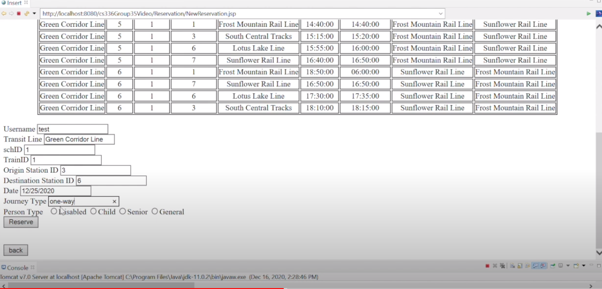

<nav>
  <a href="/">About</a>
  <a href="/ai">Artificial Intelligence</a>
  <a href="/software"  class="active">Software Development</a>
  <a href="/network">Networking and Architecture</a>
  <a href="/mobile">Mobile Programming</a>
  <a href="/other">Logical and Functional Programming</a>
</nav>

### Software

**Pizza Ordering System:**

<video controls="controls" src="vids/pizza.mp4">
    Your browser does not support the HTML5 Video element.
</video>
 

Using Java's abstract classes as well as Polymorphism, I developed a GUI using JavaFX which enabled the
users to order Pizza from a Pizza Store. The user is able to choose from the menu as well as build their own
from the various topping choices given to the user. When finished, the user is able to open their order on a
separate window and proceed to conrm their order, go back to the menu, or clear the order entirely.

**Online Railway Booking System:**

Click below to watch!

This is a group project where we made a relational database system designed to support the operations of an online railway booking system. HTML was used for the user interface, MYSQL for the database server, and Java, Javascript, and JDBC was used for the connectivity between the user interface and database server. It was hosted under AWS for a period of time but the instance has been taken down as the free tier is no longer available. The video is a demo of the functions including reservations, questions and answers between customer reps and customers, and other admin functions.
